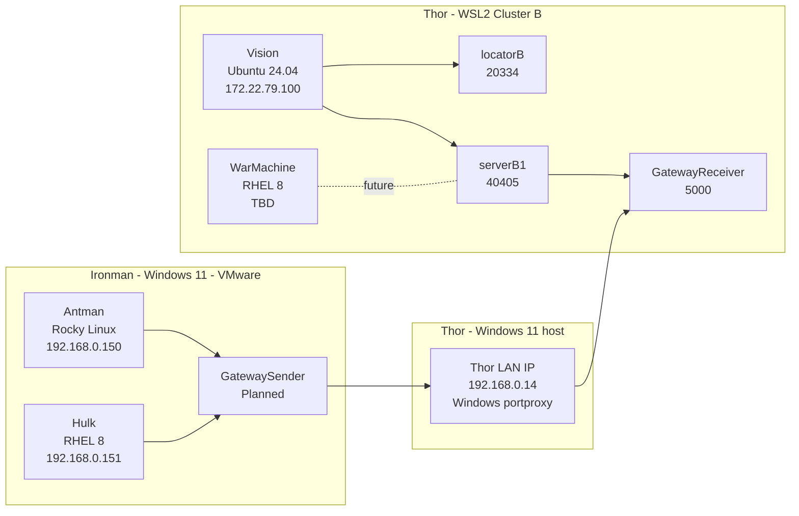

# Apache Geode WAN Replication Lab Plan and Execution Runbook
**Environment:** Antman / Hulk / Vision / WarMachine  
**Purpose:** Build Apache Geode WAN replication using GatewaySender and GatewayReceiver  
**Current status:** Cluster B receiver side is up and validated; Cluster A sender side is in progress

---

## 1. Lab topology

### 1.1 Physical layout

#### Cluster A - Source side - Ironman Windows 11 PC - VMware Workstation 17 Pro
- **Antman** - Rocky Linux 8 - `192.168.0.150`
- **Hulk** - RHEL 8 - `192.168.0.151`

#### Cluster B - Target side - Thor Windows 11 PC - WSL2
- **Vision** - Ubuntu 24.04 - internal WSL2 IP `172.22.79.100`
- **WarMachine** - RHEL 8 WSL2 - same WSL2 NAT domain, external access will be through Thor

#### Thor Windows host
- **Thor** - Windows 11 host IP `192.168.0.14`
- **Role** - external entry point for WSL2 workloads using Windows port forwarding

---

## 2. Target WAN design

### 2.1 Distributed system IDs
- **Cluster A** = `1`
- **Cluster B** = `2`

### 2.2 Planned Geode roles
- **Cluster A**
  - Antman: locator + server
  - Hulk: server
  - GatewaySender lives here
- **Cluster B**
  - Vision: locator + server
  - WarMachine: optional second server later
  - GatewayReceiver lives here

### 2.3 Ports in use or planned

| Component | Host | Port | Purpose |
|---|---|---:|---|
| Locator A | Antman | 10334 | Cluster A locator |
| Locator B | Vision | 20334 | Cluster B locator |
| Server port B1 | Vision | 40405 | Server member port |
| GatewayReceiver | Vision via Thor | 5000 | WAN receiver entry point |
| HTTP service existing old locator | Antman | 7070 | Existing locator1 service |
| JMX existing old locator | Antman | 1099 | Existing locator1 manager |

### 2.4 WAN traffic path

```text
Antman/Hulk -> GatewaySender -> Thor 192.168.0.14:5000 -> Vision 172.22.79.100:5000 -> GatewayReceiver
```

---

## 3. Mermaid architecture diagram



---

## 4. Completed setup with every executed command and validation

## Step 1 - Validate Cluster A can reach Thor

### Executed on Antman
```bash
ping -c2 192.168.0.14
```

### Result
```text
2 packets transmitted, 2 received, 0% packet loss
rtt min/avg/max/mdev = 2.615/3.182/3.750/0.570 ms
```

### Validation
- **PASS** - Antman can reach Thor over LAN

### Executed on Antman
```bash
nc -zv 192.168.0.14 5000
```

### Result
```text
Ncat: Connection refused.
```

### Validation
- **EXPECTED at this stage** - port forwarding/listener not ready yet

### Executed on Hulk
```bash
ping -c2 192.168.0.14
```

### Result
```text
2 packets transmitted, 2 received, 0% packet loss
rtt min/avg/max/mdev = 4.780/5.946/7.112/1.166 ms
```

### Validation
- **PASS** - Hulk can reach Thor over LAN

### Executed on Hulk
```bash
nc -zv 192.168.0.14 5000
```

### Result
```text
Ncat: Connection refused.
```

### Validation
- **EXPECTED at this stage** - receiver path not active yet

---

## Step 2 - Confirm Vision WSL2 IP

### Executed on Vision
```bash
hostname -I
```

### Result
```text
172.22.79.100
```

### Validation
- **PASS** - Vision internal WSL2 IP identified for port forwarding and bind-address use

---

## Step 3 - Fix Vision hostname resolution before package operations

### Problem observed on Vision
```bash
sudo apt update
```

### Result
```text
sudo: unable to resolve host Vision: Temporary failure in name resolution
```

### Resolution performed
- `/etc/hosts` was corrected so the hostname `Vision` resolves locally

### Validation command executed on Vision
```bash
sudo apt update
```

### Validation result
- No hostname resolution error after the fix

### Validation
- **PASS** - hostname issue resolved

---

## Step 4 - Verify Java availability on Vision

### Executed on Vision
```bash
java --version
```

### Result
```text
openjdk 11.0.30 2026-01-20
OpenJDK Runtime Environment (build 11.0.30+7-post-Ubuntu-1ubuntu124.04)
```

### Validation
- **PASS** - Java 11 available for Geode

---

## Step 5 - Verify Apache Geode on Vision

### Executed on Vision
```bash
gfsh version
```

### Result
```text
1.15.2
```

### Validation
- **PASS** - Apache Geode 1.15.2 installed and `gfsh` works

---

## Step 6 - Validate Thor port-forwarded receiver path

### Executed on Antman
```bash
nc -zv 192.168.0.14 5000
```

### Result
```text
Ncat: Connected to 192.168.0.14:5000.
Ncat: 0 bytes sent, 0 bytes received in 0.01 seconds.
```

### Validation
- **PASS** - Thor port forwarding path to Vision is working

---

## Step 7 - Start Cluster B locator on Vision

### First attempt that failed
```bash
gfsh
start locator   --name=locatorB   --dir=/home/alex/geode_cluster_b/locatorB   --port=20334   --bind-address=0.0.0.0   --hostname-for-clients=192.168.0.14   --J=-Dgemfire.distributed-system-id=2
```

### Result
```text
The Locator process terminated unexpectedly with exit status 1.
```

### Corrected command executed on Vision
```bash
start locator   --name=locatorB   --dir=/home/alex/geode_cluster_b/locatorB   --port=20334   --bind-address=172.22.79.100   --hostname-for-clients=192.168.0.14   --J=-Dgemfire.distributed-system-id=2
```

### Validation command executed on Vision
```bash
list members
```

### Validation result
```text
Member Count : 1

locatorB | 172.22.79.100(locatorB:2549:locator)<ec><v0>:41000 [Coordinator]
```

### Validation
- **PASS** - Cluster B locator is running with distributed-system-id 2

---

## Step 8 - Start Cluster B server on Vision

### Executed on Vision
```bash
start server   --name=serverB1   --dir=/home/alex/geode_cluster_b/serverB1   --server-port=40405   --bind-address=172.22.79.100   --hostname-for-clients=192.168.0.14   --locators=172.22.79.100[20334]
```

### Validation command executed on Vision
```bash
list members
```

### Validation result
```text
Member Count : 2

locatorB | 172.22.79.100(locatorB:2549:locator)<ec><v0>:41000 [Coordinator]
serverB1 | 172.22.79.100(serverB1:2731)<v1>:41001
```

### Validation
- **PASS** - `serverB1` joined Cluster B

---

## Step 9 - Create GatewayReceiver on Cluster B

### Executed on Vision
```bash
create gateway-receiver   --member=serverB1   --start-port=5000   --end-port=5000   --bind-address=172.22.79.100   --hostname-for-senders=192.168.0.14   --manual-start=false
```

### Command result
```text
Member  | Status | Message
serverB1 | OK     | GatewayReceiver created on member "serverB1" and will listen on the port "5000"

Configuration change is not persisted because the command is executed on specific member.
```

### Validation command executed on Vision
```bash
list gateways
```

### Validation result
```text
GatewayReceiver Section

Member                                   | Port | Sender Count | Senders Connected
172.22.79.100(serverB1:2731)<v1>:41001   | 5000 | 0            |
```

### Additional validation executed on Antman
```bash
nc -zv 192.168.0.14 5000
```

### Additional validation result
```text
Ncat: Connected to 192.168.0.14:5000.
Ncat: 0 bytes sent, 0 bytes received in 0.01 seconds.
```

### Validation
- **PASS** - GatewayReceiver is active and reachable from Cluster A through Thor

### Important note
- The persistence warning is informational, not an error.
- It means the receiver is live on `serverB1`, but the config was not saved into shared cluster configuration.

---

## Step 10 - Investigate existing locator conflict on Antman

### Initial attempt executed on Antman
```bash
gfsh
start locator   --name=locatorA   --dir=/home/alex/geode_cluster_a/locatorA   --port=10334   --bind-address=192.168.0.150   --hostname-for-clients=192.168.0.150   --J=-Dgemfire.distributed-system-id=1
```

### Result
```text
The Locator process terminated unexpectedly with exit status 1.
Exception in thread "main" java.lang.RuntimeException:
An IO error occurred while starting a Locator in /home/alex/geode_cluster_a/locatorA on 192.168.0.150[10334]:
Network is unreachable; port (10334) is not available on Antman.
```

### Diagnostic commands executed on Antman
```bash
ip addr
hostname
hostname -I
getent hosts Antman
cat /etc/hosts
ls -lah /home/alex/geode_cluster_a/locatorA
find /home/alex/geode_cluster_a/locatorA -maxdepth 1 -type f | sort
ss -ltnp | egrep '10334|1099|7070' || true
ps -fp 2469
readlink -f /proc/2469/cwd
jcmd 2469 VM.command_line
```

### Key diagnostic results
```text
ens160 has 192.168.0.150/24
getent hosts Antman -> fe80::45ab:a5f3:6c2a:da93 Antman
/home/alex/geode_cluster_a/locatorA was empty

LISTEN *:7070 users:(("java",pid=2469,...))
LISTEN *:10334 users:(("java",pid=2469,...))
LISTEN *:1099 users:(("java",pid=2469,...))

working directory -> /home/alex/geode_cluster/locator1
java_command -> org.apache.geode.distributed.LocatorLauncher start locator1 --port=10334
```

### Root cause confirmed
- An older Geode locator was already running on Antman and holding `10334`, `7070`, and `1099`

### Validation
- **PASS** - old locator conflict identified
- **Current blocker** - old `locator1` must be stopped before the new WAN-correct `locatorA` can be started

---

## 5. Consolidated validation summary

| Validation item | Command | Result | Status |
|---|---|---|---|
| Antman reachability to Thor | `ping -c2 192.168.0.14` | 0% loss | PASS |
| Hulk reachability to Thor | `ping -c2 192.168.0.14` | 0% loss | PASS |
| Vision WSL IP discovery | `hostname -I` | `172.22.79.100` | PASS |
| Vision Java validation | `java --version` | OpenJDK 11.0.30 | PASS |
| Geode validation on Vision | `gfsh version` | `1.15.2` | PASS |
| Cluster B locator validation | `list members` | `locatorB` visible | PASS |
| Cluster B server validation | `list members` | `locatorB`, `serverB1` visible | PASS |
| GatewayReceiver validation | `list gateways` | receiver on 5000 | PASS |
| End-to-end receiver path | `nc -zv 192.168.0.14 5000` | connected | PASS |
| Antman locatorA failure analysis | `ss`, `ps`, `jcmd` | old locator found | PASS |

---

## 6. Issues encountered and resolutions

### Issue A - Vision hostname resolution failed during sudo
**Symptom**
```text
sudo: unable to resolve host Vision: Temporary failure in name resolution
```

**Resolution**
- Corrected `/etc/hosts` on Vision

**Outcome**
- `sudo apt update` no longer showed hostname error

### Issue B - Cluster B locator failed with generic bind choice
**Symptom**
- `locatorB` failed when started with `--bind-address=0.0.0.0`

**Resolution**
- Restarted with:
  ```bash
  --bind-address=172.22.79.100
  --hostname-for-clients=192.168.0.14
  ```

**Outcome**
- `locatorB` started successfully

### Issue C - GatewayReceiver persistence warning
**Symptom**
```text
Configuration change is not persisted because the command is executed on specific member.
```

**Resolution**
- No fix needed for current lab phase

**Outcome**
- Receiver is live, but future restart automation should recreate or persist config

### Issue D - Cluster A locator startup failure
**Symptom**
```text
Network is unreachable; port (10334) is not available on Antman.
```

**Resolution**
- Investigated NICs, hostname resolution, open ports, and running Java processes
- Confirmed an older locator was already bound to `10334`, `7070`, and `1099`

**Outcome**
- Must shut down old `locator1` before starting the new WAN-correct `locatorA`

---

## 7. Step-by-step execution runbook

## Phase A - Completed runbook steps

### A1. Verify network path from Cluster A to Thor
Run on Antman:
```bash
ping -c2 192.168.0.14
nc -zv 192.168.0.14 5000
```

Run on Hulk:
```bash
ping -c2 192.168.0.14
nc -zv 192.168.0.14 5000
```

### A2. Identify the Vision WSL2 IP
Run on Vision:
```bash
hostname -I
```

### A3. Fix local hostname resolution on Vision if needed
Run on Vision:
```bash
sudo apt update
```

If hostname resolution fails:
- correct `/etc/hosts`
- retry `sudo apt update`

### A4. Verify Java and Geode on Vision
Run on Vision:
```bash
java --version
gfsh version
```

### A5. Start Cluster B locator
Run in `gfsh` on Vision:
```bash
start locator   --name=locatorB   --dir=/home/alex/geode_cluster_b/locatorB   --port=20334   --bind-address=172.22.79.100   --hostname-for-clients=192.168.0.14   --J=-Dgemfire.distributed-system-id=2
```

Validate:
```bash
list members
```

### A6. Start Cluster B server
Run in `gfsh` on Vision:
```bash
start server   --name=serverB1   --dir=/home/alex/geode_cluster_b/serverB1   --server-port=40405   --bind-address=172.22.79.100   --hostname-for-clients=192.168.0.14   --locators=172.22.79.100[20334]
```

Validate:
```bash
list members
```

### A7. Create GatewayReceiver
Run in `gfsh` on Vision:
```bash
create gateway-receiver   --member=serverB1   --start-port=5000   --end-port=5000   --bind-address=172.22.79.100   --hostname-for-senders=192.168.0.14   --manual-start=false
```

Validate:
```bash
list gateways
```

Also validate from Antman:
```bash
nc -zv 192.168.0.14 5000
```

---

## Phase B - Next runbook steps to continue

### B1. Stop the old Antman locator that blocks port 10334
Run on Antman:
```bash
gfsh
connect --locator=192.168.0.150[10334]
shutdown --include-locators=true
```

Validate in Linux shell:
```bash
ss -ltnp | egrep '10334|1099|7070' || true
```

### B2. Start the correct Cluster A locator
Run in `gfsh` on Antman:
```bash
start locator   --name=locatorA   --dir=/home/alex/geode_cluster_a/locatorA   --port=10334   --bind-address=192.168.0.150   --hostname-for-clients=192.168.0.150   --J=-Dgemfire.distributed-system-id=1
```

Validate:
```bash
list members
```

### B3. Start Cluster A server on Antman
Planned command:
```bash
start server   --name=serverA1   --dir=/home/alex/geode_cluster_a/serverA1   --server-port=40404   --bind-address=192.168.0.150   --hostname-for-clients=192.168.0.150   --locators=192.168.0.150[10334]
```

Validate:
```bash
list members
```

### B4. Start Cluster A server on Hulk
Planned command:
```bash
start server   --name=serverA2   --dir=/home/alex/geode_cluster_a/serverA2   --server-port=40404   --bind-address=192.168.0.151   --hostname-for-clients=192.168.0.151   --locators=192.168.0.150[10334]
```

Validate:
```bash
list members
```

### B5. Create Cluster A GatewaySender
Planned command:
```bash
create gateway-sender   --id=senderA   --remote-distributed-system-id=2   --parallel=false   --manual-start=false
```

Validate:
```bash
list gateways
```

### B6. Create region on Cluster B
Planned command:
```bash
create region --name=Activity --type=REPLICATE
```

Validate:
```bash
list regions
```

### B7. Create matching region on Cluster A and attach sender
Planned command:
```bash
create region   --name=Activity   --type=REPLICATE   --gateway-sender-id=senderA
```

Validate:
```bash
list regions
describe region --name=Activity
```

### B8. Test WAN replication
Example validation sequence on Cluster A:
```bash
put --region=Activity --key=REF100 --value=Value100
get --region=Activity --key=REF100
```

Validation on Cluster B:
```bash
get --region=Activity --key=REF100
```

---

## 8. Current state snapshot

### Ready
- Vision reachable through Thor on port `5000`
- Cluster B locator and server are up
- Cluster B GatewayReceiver is active
- Receiver path from Antman to Vision is validated

### In progress
- Cluster A rebuild for WAN-correct locator and sender

### Blocker
- Existing Antman `locator1` still owns port `10334`

---

## 9. LLM revisit notes

When another LLM or future session resumes from this document, it should assume:
1. Do not recreate Cluster B receiver side unless it has been shut down.
2. First action should be stopping old `locator1` on Antman.
3. After the old locator is stopped, continue with:
   - `locatorA`
   - `serverA1`
   - `serverA2`
   - `GatewaySender`
   - region creation
   - replication validation
4. GatewayReceiver currently exists only on `serverB1` member scope and is not yet persisted in shared cluster configuration.

---

## 10. One-line status

**Cluster B receiver side is fully up and validated; Cluster A sender side is blocked only by an older locator already occupying Antman port 10334.**
